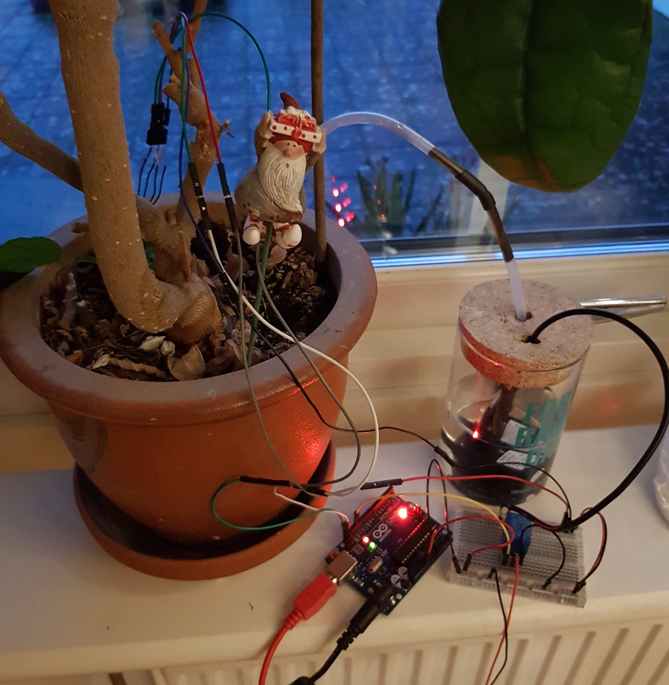

# House-Plant Watering System

Using the [Adafruit STEMMA Soil Sensor - I2C Capacitive Moisture Sensor](https://learn.adafruit.com/adafruit-stemma-soil-sensor-i2c-capacitive-moisture-sensor/overview) we are able to measure how moist the house plants soil is, aswell as the temperature. In this guide I will present two ways of making this system. The first way will be through a wireless Wemos D1 board using MQTT protocol through Shiftr.io MQTT Broker. The Second way will be a simpler and offline system using the standard Arduino Uno. Both of these setups has pros and cons in regard to complexity and features possible. This projekt is not just about throwing a few components together and forget about your plants, rather this project aims to understand how adapting the electronics to the specific needs of your house-plant.



Through the years I have been interested in self-watering plant systems. I tried to make one in 2019 during the AUHack hackathon, however this version was not inteded to be fully function but work as a proof of concept for a larger project idea. Since then I have done a lot of research and I found that a lot of the self-watering plant kits you can buy online or watch people build on youtube is very focused on just the electronic side, and not acknowledging what the plant needs. I am by no means saying that this repo is perfekt in this regard but I really want to make this repo as much about plants as it is about the system and the possibilities this gives for exstracting data for other purposes.


- **GND** - power and logic ground
- **VIN** - 3-5V DC (use the same power voltage as you would for I2C logic)
- **I2C SDA** - there's a 10K pullup to VIN
- **I2C SCL** - there's a 10K pullup to VIN

## Wireless Approach: Plant watering using ESP8266 Wemos D1


- **D1** = I2C SCL
- **D2** = I2C SDA
- **3v3** = Vin
- **G** = GND

First we need to connect the wemos d1 and the soil moisture sensor to each other.


The flowchart consists of six elements; ESP8622-board, Soil-moisture sensor, relay, water-pump and 3.3v to 5v step-up converter. I encountered a problem with using the ESP8622 Wemos D1 board. The digital pinouts on the wemos board only sends out a tiny voltage below 3.3 volts, which is not enough to control the 5 V relay that I had available at the time. Potentially this could be solved using a [step-up converter](https://let-elektronik.dk/shop/1600-konvertere/400006-dc-dc-step-up-3a-in-3v-32v-out-5v-35v/?gclid=Cj0KCQjwpLfzBRCRARIsAHuj6qXY-hQAGwsX-FOLJn6lXlf8ivB59mNgCV-gL_8G2f56atvbJCiXHZYaAi7nEALw_wcB) module converting the very low voltage to 5 V in order for it to succesfully control the water pump.

Now that the hardware is connected we can look at the code for the system.

```c
//libraries
#include <ESP8266WiFi.h>
#include <MQTTClient.h>
#include "Adafruit_seesaw.h"

Adafruit_seesaw ss;

// wifi name
const char ssid[] = "INSERT WIFI NAME";
// wifi code
const char pass[] = "INSERT WIFI CODE";

// Insert 'key/username' from shiftr
const char key[] = "PlantFeeling";
// Insert secret/password frrom shiftr
const char secret[] = "372575487ca8b282";

WiFiClient net;
MQTTClient client;

void connect();

void setup() {
  Serial.begin(115200);
  WiFi.begin(ssid, pass);
  client.begin("broker.shiftr.io", net);
  client.onMessage(messageReceived);
  connect();

//Soil-moisture sensor
  if (!ss.begin(0x36)) {
    Serial.println("ERROR! seesaw not found");
    while(1);
  } else {
    Serial.print("seesaw started! version: ");
    Serial.println(ss.getVersion(), HEX);
  }
  
}
// Checking Wifi-status
void connect() {
  Serial.print("checking wifi...");
  while (WiFi.status() != WL_CONNECTED) {
    Serial.print(".");
    delay(1000);
  }

  Serial.print("\nconnecting...");
  while (!client.connect("Plant", key, secret)){
    Serial.print(".");
    delay(1000);
  }
  Serial.println("\nconnected!");
  
  client.subscribe("/PlantThirst");
  client.subscribe("/Temperature");
}

void loop() {
  client.loop();
  delay(10);

  if (!client.connected()) {
    connect();
  }

  // soil-moisure sensor
  float tempC = ss.getTemp();
  String stringtempC = String(tempC);
  uint16_t capread = ss.touchRead(0);
  String stringCapread = String(capread);
  
  publishMessage("PlantThirst", stringCapread);
  publishMessage("Temperature", stringtempC);
  delay(500);
}
void publishMessage(String topic, String message){
  client.publish(topic, message);
}
void messageReceived(String &topic, String &payload) {
  Serial.println("incoming: " + topic + " - " + payload);
  if (topic=="/PlantThirst") {
    int v = payload.toInt();
    if (v<350) {
      Serial.println("Plant Need water");
      }
    }
}
```

Getting the values from the adafruit soil moisture sensor into the arduino, and then sending it to a [MQTT broker](https://shiftr.io/L4COUR/Shawn) and then back again to the console in order for it to control a relay-switch, which would turn on the water pump. By running the data through the MQTT broker, it makes the temperature and plantthirst data available to be recieved by other programs and used for other purposes. fx. using the [Max/MSP MQTT external](https://github.com/256dpi/max-mqtt) 


## Offline Approach: Plant watering using Arduino Uno

The benefit of creating a circuit offline is that we don't need to use the Wemos D1 board, but can instead use an old school Arduino Uno, which has a higher pinout voltage enabling us to control the 5 volt relay without using any step-up converters.


- **D19** = SCL
- **D18** = SDA
- **5V** = Vin
- **GND** = G

First we need to connect the Arduino and the soil moisture sensor to each other.


Notice here that we don´t need to use any step-up converters for the relay, since the Arduino Uno's pinouts has a higher voltage output.

The code is of course a little different from the wireless wemos d1 code, since we dont need to connect it to the wifi or MQTT broker.

```C
#include "Adafruit_seesaw.h"

Adafruit_seesaw ss;

const int wPump = 13; // choosing a pin for the Water Pump

void setup() {
  Serial.begin(115200);

  pinMode(wPump, OUTPUT); //The Water Pump is an Output
  
  if (!ss.begin(0x36)) {
    Serial.println("ERROR! seesaw not found");
    while(1);
  } else {
    Serial.print("seesaw started! version: ");
    Serial.println(ss.getVersion(), HEX);
  }
}

void loop() {
  float tempC = ss.getTemp();
  uint16_t capread = ss.touchRead(0);

  //Serial.print("Temperature: "); Serial.print(tempC); Serial.println("*C");
  Serial.print("Capacitive: "); Serial.println(capread);
  delay(100);

  if (capread < 332) {
    Serial.println("Watering");
    digitalWrite(wPump, LOW);
    } else {
    digitalWrite(wPump, HIGH);
    }
}
```

## Adapting the system to the needs of the plant

In this setup I have chosen to adapt the setup to a ["peanut butter tree"](https://en.wikipedia.org/wiki/Clerodendrum_trichotomum) The reason being that this kind of plant don't mind being watered as soon as the soil is not moist. Other plants like the ["peace lily"](https://en.wikipedia.org/wiki/Spathiphyllum) for example prefers to dry out completly before adding more water. I think it is important to consider how we emplement this automation into our house-plants eco-system. By being as attentive to the electronic system and how these talk to each other as to the watering and caring needs of the plants, I think we are able to use technology in a more responsible way. 


## Source

- https://learn.adafruit.com/adafruit-stemma-soil-sensor-i2c-capacitive-moisture-sensor/pinouts
- https://github.com/L4COUR/Shawn-The-Plant (AUHack2019-project inspiration)
- https://github.com/256dpi/max-mqtt (connect w/ max/MSP)

